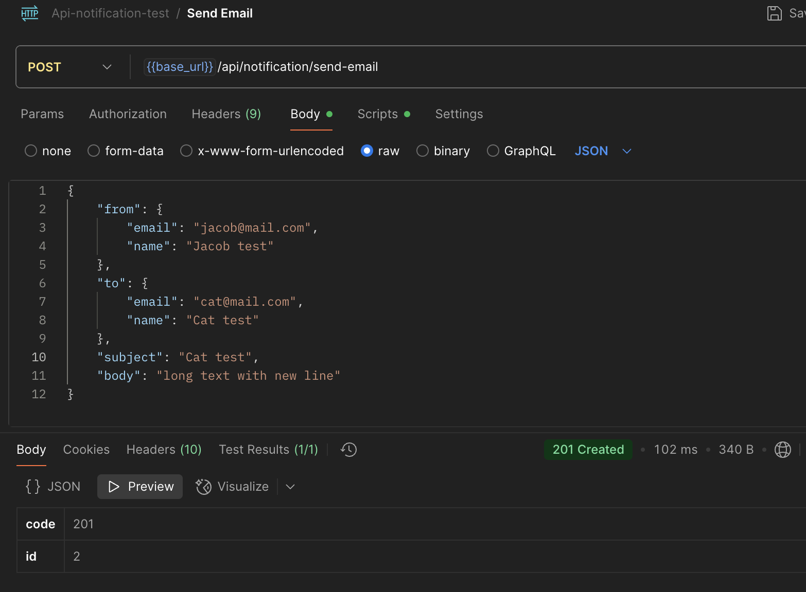
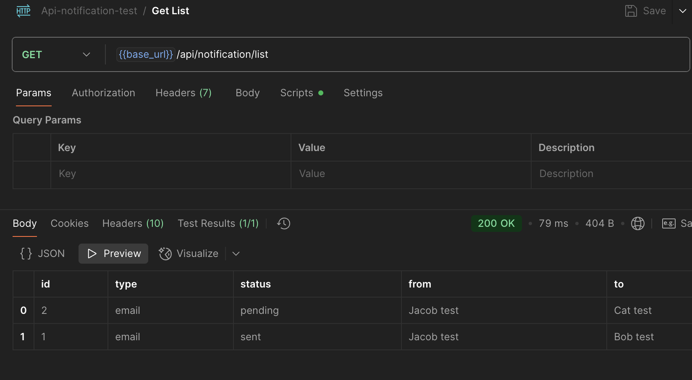
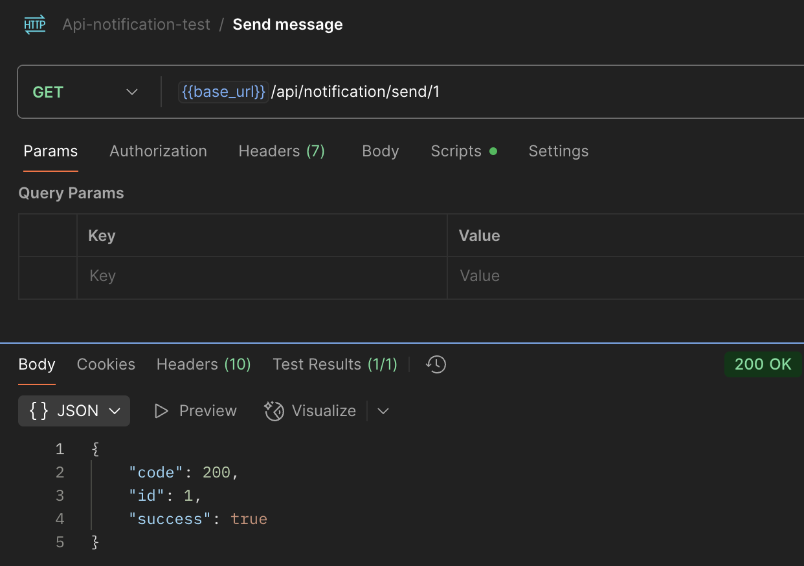
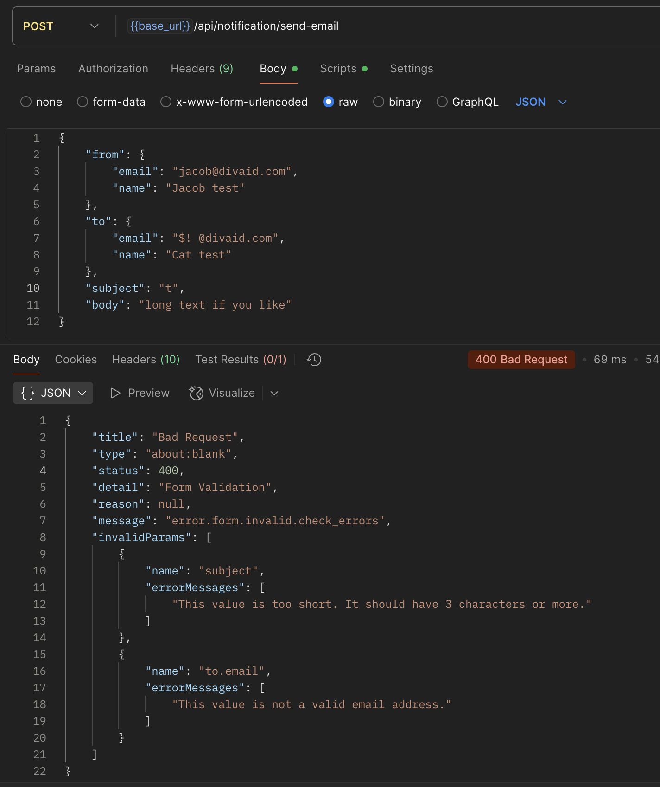

# Simple Notification API

## Overview
Your task is to create a simple API using PHP and the Symfony framework. This API will manage and send notifications.
The goal is not to build a production-ready system. We're interested in seeing your thought process and code structure.

## Requirements
The goal of this test is to implement an Email Notification API. A notification has, at a minimum, a recipient email, a subject, and a body.

## Project Setup:
Initialize a new Symfony project.
Use a database of your choice (simplicity is clearly OK here).
Use Doctrine for database interactions.

## API Endpoints:
Create an endpoint to create a new notification.
Create an endpoint to list all notifications in the database.
Create an endpoint that simulates the sending of a notification. This endpoint should accept an ID and mark the corresponding notification as "sent."

## Core Logic:
A notification should have a status (e.g., 'pending', 'sent').
When a new notification is created, its status should be 'pending'.
For the purpose of this test, "sending" a notification does not have to actually send the email, but YOU have to think of what consequences on your application it would mean if you were actually sending it.

## Submission and Evaluation
We're not just looking for a working solution; we want to understand how you got there.

## Code:
Provide a link to a Git repository containing your solution.

## Documentation/Thought Process:
In the README.md also document every choice you've made regarding architecture, decisions, workaround if needed, or anything you find relevant.

Good luck! We look forward to seeing your work.

# Result
A Symfony 6.4 LTS project running on custom build docker.
A basic but yet extendable messaging.
I thought "we" might use it for email, sms, and other notification messages: type added.

## Code
- Api Controller returning JsonResponse
- Api Controller for "not found"
- SF Argument Resolver (Former known is ParamConverter)
- DTO Model, validated with json field errors
- Exception handling, form and server message errors
- Custom Docker image, docker compose, and Makefile

## Thoughts
- TESTS ! no doubt, not a TDD development,
- YAGNI, yes, I could have kept it to the exact specs. But I wanted to show a bit more options.
- ENUM, a message could be sent as email, sms, and more. We could use Bitwise.
- Event, fire an event when message created and on sent could be another approach, Observer pattern.
- Hexagonal, Code is abstracted, use of DTO, Models and Managers.
- Service, there is no actual "email service", but the manager could have a dependency injection of Tagged Sender services.
- Validation, simple, to prove the functionality. Groups would be ideal if other types of messages to allow "contact" be created
- Indexes, Contact is found by email, no index and not unique, to be done.

## Postman
File is located in /docs

### Creating a message

### Listing messages

### Sending a message
Using "get", but a "put" would be preferred.

### Creating a message, with invalid email and to short subject

